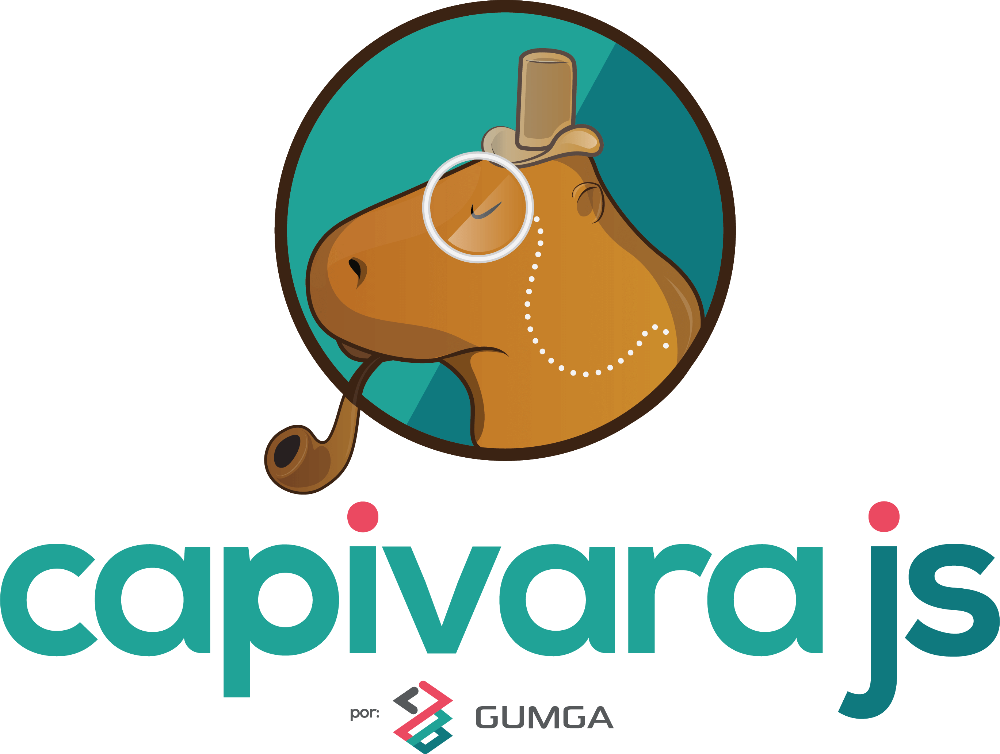

    

    
    
     
    

    
    

<h2 id="docsify">
  CapivaraJS
</h2>
<blockquote>
  
Um compilador para Web Components.

</blockquote>

## Introdução
Atualmente existem vários frameworks que possibilitam a criação de componentes, entretanto tais componentes acabam ficando isolados em determinada tecnologia, fazendo com que uma possível migração seja mais complexa.  O **CapivaraJS** é um framework híbrido e suas diretivas são totalmente personalizáveis, tornando assim os componentes independentes da tecnologia utilizada.

## Links Úteis

- [CLI](https://github.com/CapivaraJS/capivara-cli)
- CDN: [UNPKG](http://unpkg.com/capivarajs@latest/dist/capivara.min.js)
- [Github](https://github.com/CapivaraJS/capivarajs)
- [Fórum da Comunidade](https://gitter.im/capivarajs/Lobby)

## Comece agora

Acesse nosso [tutorial](GettingStarted/quickstart) e aprenda super-rápido a utilizar o CapivaraJS.

## Seja um Contribuidor do CapivaraJS

- Faça um Fork!
- Crie a sua branch com nova funcionalidade: `git checkout -b my-new-feature`
- Faça um commit da nova funcionalidade: `git commit -am 'Add some feature'`
- Faça um push da branch: `git push origin my-new-feature`
- Submeta o pull request

Toda a documentação foi baseada no template disponibilizada 
pela <a href="https://docsify.js.org" target="_blank">docsify</a>

